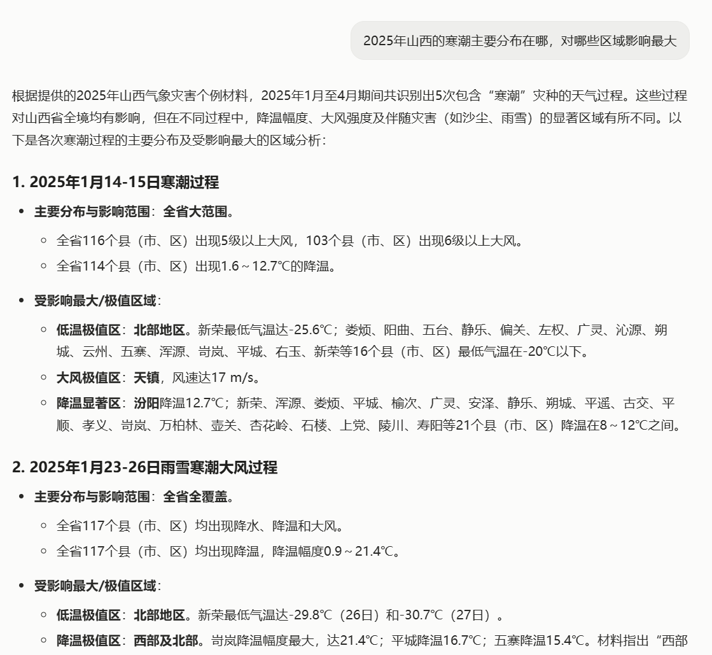
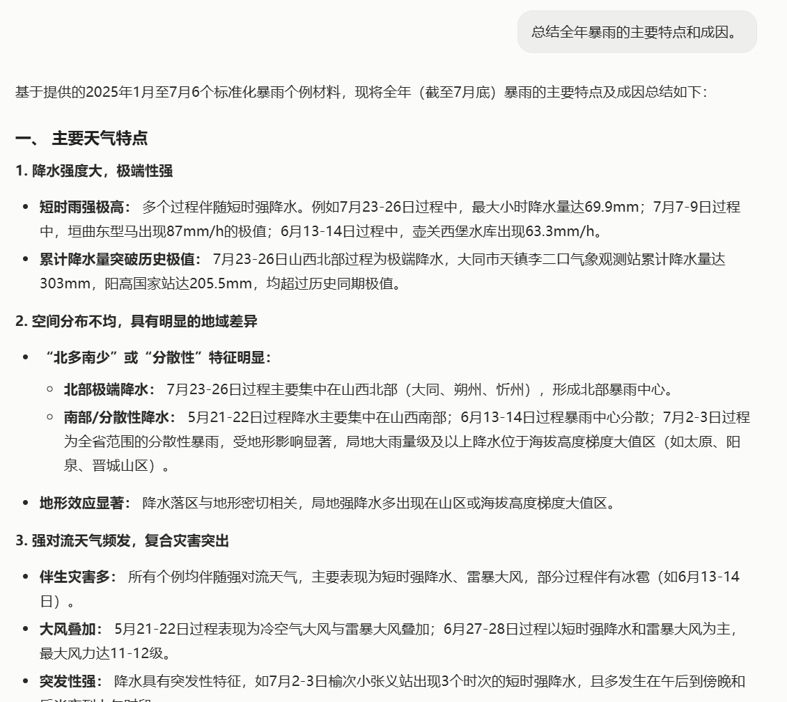
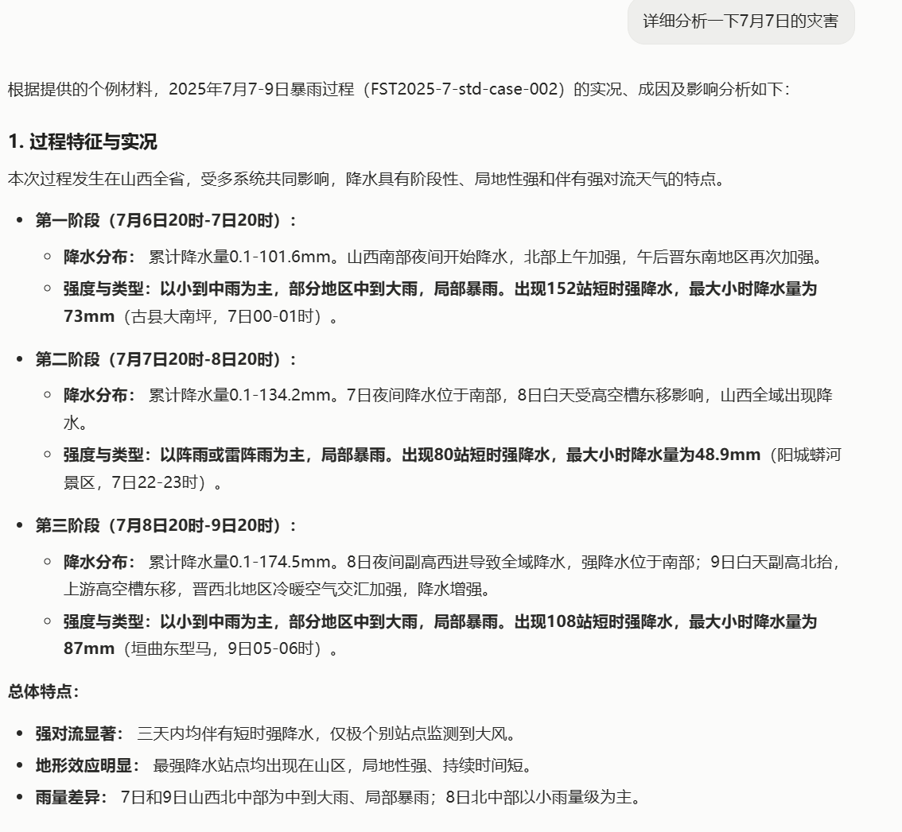
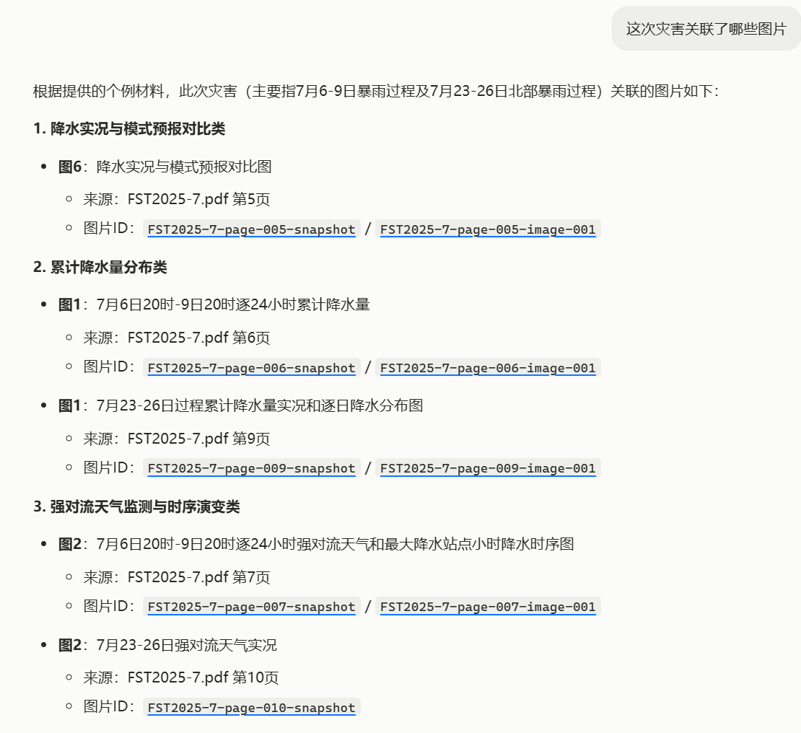
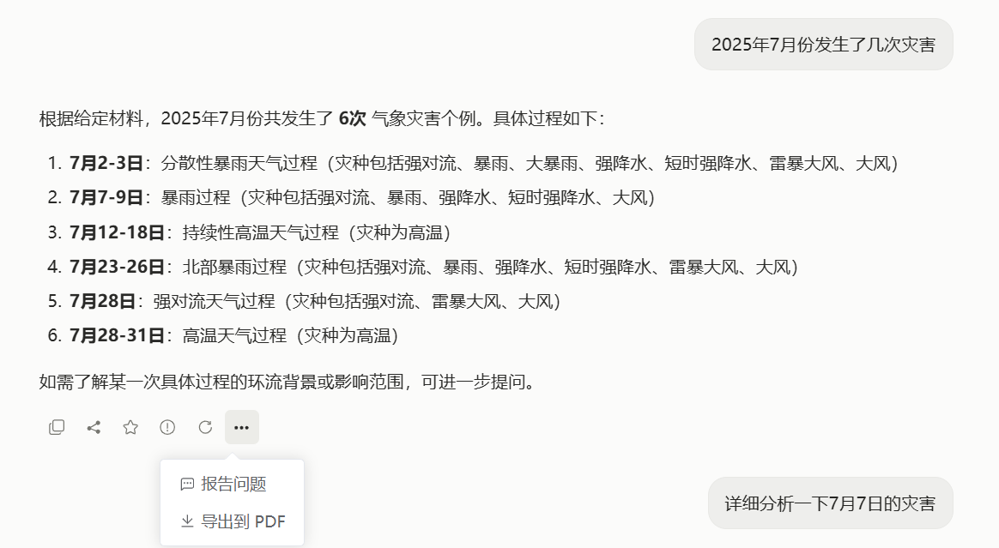

# 气象灾害个例智能分析系统

基于大语言模型、向量检索和结构化个例数据的气象灾害问答与分析平台。系统面向气象业务人员，将 PDF 个例材料整理为可检索、可分析、可追溯的知识库，用户通过一个聊天入口即可完成统计汇总、过程复盘、区域分析、相似个例匹配、图片证据查看和报告导出。

> 当前版本：统一聊天工作流（截至 2026 年 9 月）

## 项目简介

系统把气象灾害个例材料转换为三类可协同使用的数据：

- **文档片段**：PDF 按自然段切分后写入 ChromaDB，用于语义检索和通用 RAG。
- **标准化个例**：抽取过程时间、灾种、区域、强度指标、影响描述等字段，用于统计、筛选、对比和报告分析。
- **图片证据**：提取 PDF 中的雷达图、卫星云图、降水图等，并通过图片 ID、来源页码和关联片段实现证据追溯。

前端统一聊天页负责输入问题、展示流式回答和处理进度；后端根据问题意图自动选择普通文档问答、个例多维检索或 Smart 相似个例匹配链路。所有结果都可以保存到会话中，后续问题可承接上一轮结果继续追问。

### 代码功能简要说明

| 模块 | 主要功能 |
|------|----------|
| `backend/app/main.py` | 创建 FastAPI 应用，初始化模型客户端、向量库、标准化个例库、图片证据库和会话库，并注册所有路由 |
| `api/routes/agent.py` | 提供普通问答、智能体问答和统一 SSE 流式问答入口，负责把三类 Agent 的结果适配为统一消息格式 |
| `services/agent/unified_chat/` | 统一聊天编排、上下文记忆、任务拆分、进度事件、结果适配和会话反馈引导 |
| `services/agent/case_multidim_search/` | 按日期、年份、月份、灾种、地市和业务区域检索个例，生成逐例分析、图表和 PDF/CSV 报告 |
| `services/agent/Smart_Case_Match/` | 综合时间、空间、灾种、文本和图片等维度，返回相似历史个例及匹配理由 |
| `services/agent/query-intent-agent/` | 对复合问题进行意图识别、任务拆分和路由规划 |
| `services/structured_qa.py` | 基于标准化个例回答统计、对比、证据清单等结构化问题 |
| `services/knowledge_builder/` | 构建文档段向量、图片索引和标准化个例数据 |
| `services/session_store.py` | 使用 SQLite 持久化会话、消息、Agent 运行记录、反馈、分享和回答版本 |
| `frontend/src/components/` | Vue 3 聊天界面、会话列表、处理进度、Smart 结果、PDF 报告卡和消息操作 |

## 系统架构

```text
┌────────────────────────────────────────────────────────────┐
│                         Vue 3 前端                         │
│  会话列表 │ 统一聊天页 │ 流式回答 │ 图表/图片 │ 报告/消息操作 │
└────────────────────────────┬───────────────────────────────┘
                             │ HTTP + SSE
┌────────────────────────────┴───────────────────────────────┐
│                       FastAPI 后端                          │
│  统一聊天编排器：意图识别 → 任务规划 → Agent 路由 → 结果合成 │
│                                                              │
│  ┌──────────────┐  ┌────────────────┐  ┌─────────────────┐ │
│  │ 文档 RAG      │  │ 多维个例检索    │  │ Smart 相似匹配  │ │
│  │ 向量检索+重排  │  │ 统计/分析/报告  │  │ 多维度排序      │ │
│  └──────────────┘  └────────────────┘  └─────────────────┘ │
│  会话记忆 │ 进度推送 │ 最终审查 │ 反馈引导 │ 版本管理       │
└────────────────────────────┬───────────────────────────────┘
                             │
┌────────────────────────────┴───────────────────────────────┐
│                        数据与模型层                         │
│ PDF 文档 │ ChromaDB │ 标准化个例 JSON │ 图片元数据 │ SQLite │
│ DashScope Chat / Embedding / Rerank（OpenAI 兼容接口）       │
└────────────────────────────────────────────────────────────┘
```

### 一次问答的处理流程

1. 前端通过 `/api/query/stream` 提交问题，并立即显示处理中状态。
2. 统一聊天编排器结合当前会话记忆识别意图；必要时把一个复合问题拆成多个子任务。
3. 根据任务类型选择文档 RAG、结构化个例链路或 Smart 相似匹配链路。
4. 后端持续推送检索、分析、生成、保存等阶段的进度和回答增量。
5. 结果合成后写入 SQLite，会话中保存回答、证据、图片、图表、报告、Agent 链路和性能信息。
6. 最终审查器检查回答完整性；用户可以反馈、举报、分享、重新生成或导出 PDF。

## 项目结构

```text
├── backend/
│   └── app/
│       ├── api/routes/                    # 系统、向量、会话、问答接口
│       ├── services/
│       │   ├── agent/
│       │   │   ├── unified_chat/          # 统一聊天编排与会话记忆
│       │   │   ├── case_multidim_search/ # 多维个例检索与报告
│       │   │   ├── Smart_Case_Match/     # Smart 相似个例匹配
│       │   │   ├── query-intent-agent/   # 意图识别与复合任务拆分
│       │   │   ├── intent_analyzer/      # 意图分析
│       │   │   ├── planner/              # 工具规划
│       │   │   ├── orchestrator/         # 主 Agent 编排
│       │   │   ├── synthesizer/          # 回答合成
│       │   │   └── reviewer/             # 最终审查
│       │   ├── knowledge_builder/        # 知识库构建
│       │   ├── model_client/             # Chat、Embedding、Rerank 客户端
│       │   ├── document_store.py         # ChromaDB 文档片段存储
│       │   ├── standard_case_store.py    # 标准化个例存储
│       │   ├── image_extraction.py       # 图片证据管理
│       │   └── session_store.py          # SQLite 会话持久化
│       ├── config.py                      # 目录和模型配置
│       └── main.py                        # 应用入口
├── frontend/
│   ├── src/App.vue                        # 根组件与会话状态管理
│   ├── src/api.js                         # Axios、SSE 和文件接口封装
│   ├── src/components/                    # 聊天、会话、进度、报告和消息操作组件
│   └── src/styles/                        # 回答内容和基础样式
├── data/                                  # 本地知识库和运行数据（通常不提交）
│   ├── document_index/                    # ChromaDB 文档片段索引
│   ├── document_images/                    # PDF 提取图片
│   ├── image_metadata.json                 # 图片元数据
│   ├── standard_cases1.json                # 标准化个例
│   └── sessions.sqlite3                    # 会话与消息数据库
├── resource/                              # 待入库的气象灾害 PDF
├── docs/                                  # 架构、设计和开发计划
├── tests/                                 # 后端、Agent、流式接口和前端验证
├── tmp/                                   # 运行截图
├── requirements.txt                       # Python 依赖
└── API接口文档.md                          # 接口补充说明
```

## 功能演示

### 区域分布与影响范围分析

用户直接提问，系统从标准化个例中汇总过程数量、影响范围、降温幅度和大风强度，并给出区域对比。



### 跨月份灾害特征总结

系统可以把多个时间段的个例合并分析，归纳降水强度、空间分布、地形效应和复合灾害特征。



### 单个过程的分阶段复盘

对于“详细分析某次灾害”这类问题，系统按时间阶段组织降水演变、强度指标、强对流表现和总体特征。



### 图片证据关联

回答会列出图片类型、来源 PDF、页码和图片 ID。前端支持点击图片 ID 预览对应的雷达图、降水图或其他证据图。



### 统计问答与消息操作

统计结果可以继续追问；回答保存后支持复制、分享、收藏/反馈、问题上报、重新生成和导出 PDF。



## 快速开始

### 环境要求

- Python 3.10 或更高版本
- Node.js 18 或更高版本
- 可访问 DashScope OpenAI 兼容接口的 API Key
- 运行 PDF 文档化和图片提取时，建议预留足够磁盘空间

### 1. 配置环境变量

在项目根目录创建 `.env`：

```env
# 必填：DashScope API Key，也兼容 ALIYUN_API_KEY
DASHSCOPE_API_KEY=sk-xxxxxxxxxxxxxxxxxxxxxxxxxxxxxxxx

# DashScope OpenAI 兼容接口
DASHSCOPE_BASE_URL=https://dashscope.aliyuncs.com/compatible-mode/v1

# 模型配置，可按部署环境覆盖
DASHSCOPE_CHAT_MODEL=qwen-plus
DASHSCOPE_INTENT_MODEL=qwen-plus
DASHSCOPE_FOLLOWUP_MODEL=qwen-plus
DASHSCOPE_EMBEDDING_MODEL=text-embedding-v4
DASHSCOPE_RERANK_MODEL=qwen3-rerank

# 可选：重排序服务的独立地址
# DASHSCOPE_RERANK_ENDPOINT=
```

代码会优先读取 `DASHSCOPE_API_KEY`，同时兼容旧配置名 `ALIYUN_API_KEY` 和 `ALiYunAPI`。

### 2. 安装后端依赖并启动后端

```bash
pip install -r requirements.txt
uvicorn backend.app.main:app --reload --host 0.0.0.0 --port 8000
```

后端地址：

- Swagger：<http://localhost:8000/docs>
- 健康检查：<http://localhost:8000/api/health>
- 知识库状态：<http://localhost:8000/api/knowledge/status>

### 3. 安装前端依赖并启动前端

```bash
cd frontend
npm install
npm run dev
```

默认访问 <http://localhost:5173>。如后端不在 `http://127.0.0.1:8000`，可通过 `VITE_API_ORIGIN` 指定后端地址：

```bash
VITE_API_ORIGIN=http://localhost:8000 npm run dev
```

### 4. 构建知识库

将气象灾害 PDF 放入 `resource/`，确保后端已启动后执行：

```bash
curl -X POST http://localhost:8000/api/documents/index
```

该操作会重建文档片段向量索引、图片证据索引和标准化个例数据。数据默认写入 `data/`，首次构建和模型调用耗时取决于 PDF 数量与 API 配额。

## 使用说明

### 统一聊天入口

打开前端后，在同一个输入框中直接使用自然语言提问。系统不要求用户先选择功能模块，会自动判断问题类型并选择对应 Agent。

可以尝试：

```text
2025年山西的寒潮主要分布在哪里，对哪些区域影响最大？
总结全年暴雨的主要特点和成因。
详细分析一下7月7日的灾害。
这次灾害关联了哪些图片？
2025年7月份发生了几次灾害？
当前山西北部出现强对流，历史上有哪些相似过程？
```

### 三类主要处理链路

| 问题类型 | 处理链路 | 典型结果 |
|----------|----------|----------|
| 统计、筛选、对比、过程分析、报告生成 | 多维个例检索 Agent | 个例列表、统计指标、强度分析、图表、报告 |
| 历史过程相似性、参考经验、相似天气判断 | Smart Case Match Agent | 相似个例、匹配维度、相似度和解释 |
| 材料问答、证据补充、无法结构化的问题 | 文档 RAG | 流式文本回答、文档片段、关联图片 |

### 流式回答与处理中状态

提交问题后，页面会显示当前 Agent、阶段和百分比进度，例如检索证据、整理结构化事实、生成回答、保存结果。回答正文以 SSE 增量方式显示；即使模型不可用，系统也会优先使用结构化数据和本地证据完成降级回答。

### 图片、图表与报告

- 回答中的图片 ID 可以点击预览原图。
- 统计和分析结果可以展示表格、柱状图等轻量可视化。
- 多维检索支持 CSV 导出和 PDF 报告生成。
- 对上一轮结果提出“整理成报告”或“导出 PDF”时，可复用已保存的分析结果，再进行本地 PDF 排版。

### 会话、上下文和消息操作

- 左侧会话列表支持创建、重命名、切换和删除会话。
- 后续问题可以引用上一轮的个例范围和分析结果。
- 已完成回答支持重新生成，可附带本次重生成要求，并通过版本导航查看旧答案。
- 支持复制、分享、正向/改进反馈、问题上报和 PDF 导出。

## API 接口概览

### 主应用接口

| 方法 | 路径 | 说明 |
|------|------|------|
| GET | `/api/health` | 检查应用、知识库和模型状态 |
| GET | `/api/knowledge/status` | 查看索引构建状态和模型配置 |
| POST | `/api/documents/index` | 从 `resource/` 重建文档、图片和标准个例索引 |
| GET | `/api/image-evidence/{image_id}` | 获取图片证据文件 |
| POST | `/api/query` | 非流式普通问答 |
| POST | `/api/agent/query` | 返回意图、执行计划、审计链路和证据的智能体问答 |
| POST | `/api/query/stream` | 统一 SSE 流式问答入口 |

### 会话与消息接口

| 方法 | 路径 | 说明 |
|------|------|------|
| POST | `/api/sessions` | 创建会话 |
| GET | `/api/sessions` | 列出会话 |
| GET | `/api/sessions/{session_id}/messages` | 获取会话消息 |
| PATCH | `/api/sessions/{session_id}` | 更新会话标题 |
| DELETE | `/api/sessions/{session_id}` | 删除会话 |
| POST | `/api/sessions/{session_id}/messages/{message_id}/feedback` | 保存回答反馈 |
| POST | `/api/sessions/{session_id}/messages/{message_id}/report` | 上报回答问题 |
| POST | `/api/sessions/{session_id}/messages/{message_id}/share` | 创建分享链接 |
| POST | `/api/sessions/{session_id}/messages/{message_id}/export-pdf` | 导出单条回答 PDF |
| GET | `/api/shared-messages/{token}` | 获取分享内容 |

### 专用 Agent 接口

多维个例检索接口统一挂载在 `/api/case-multidim` 下，提供自然语言解析、结构化检索、进度查询、CSV/PDF 导出、报告和图片资源访问；Smart 相似匹配接口统一挂载在 `/api/smart-case-match` 下，提供匹配检索、自然语言流式会话、进度和证据资源访问。完整字段和请求体请参见 [`API接口文档.md`](API接口文档.md) 及 Swagger。

## 开发与测试

运行全部测试：

```bash
python -m pytest tests/ -v
```

运行特定模块测试：

```bash
python -m pytest backend/app/services/agent/Smart_Case_Match/tests -v
python -m pytest backend/app/services/agent/unified_chat/tests -v
python -m pytest backend/app/services/agent/case_multidim_search/tests -v
```

前端构建检查：

```bash
cd frontend
npm run build
```

## 常见问题

### 没有配置 API Key 能否启动？

可以启动服务和查看部分本地接口，但涉及意图解析、Embedding、Rerank 或回答生成时可能无法调用云端模型。系统会在可用范围内退回规则、结构化数据或本地文档证据。

### 如何更新知识库？

把新 PDF 放入 `resource/` 后重新调用 `POST /api/documents/index`。该接口面向管理员使用，普通用户只需在聊天页提问。

### 为什么回答中有图片 ID 而没有图片？

请确认对应图片已经生成到 `data/document_images/`，并检查 `/api/image-evidence/{image_id}` 是否可访问。图片是增强证据，图片加载失败时文字回答仍会保留。

### 多维检索和 Smart 匹配是否还有独立页面？

后端保留 `/api/case-multidim` 和 `/api/smart-case-match` 专用接口，前端日常使用统一聊天入口。用户无需手动选择 Agent，系统会根据问题自动路由。

### 报告生成需要重新调用模型吗？

首次多维分析报告通常会调用逐例分析和图表生成流程；针对上一轮结果的报告请求会优先复用已保存的分析结果，再进行本地 PDF 排版。

## 许可证与使用范围

本项目当前用于内部研究和业务验证。知识库中的 PDF、图片、模型密钥和运行数据可能包含内部资料，请按部署环境做好访问控制，不要将 `.env`、`data/` 或 `resource/` 中的敏感内容提交到公共仓库。

---

**最后更新：2026 年 9 月**
