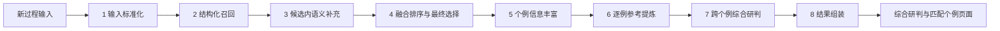

# 相似个例智能匹配体：当前实现复盘与汇报材料

> 整理时间：2026-08-10  
> 项目目录：`backend/app/services/agent/Smart_Case_Match`  
> 说明：本文以当前代码和实际运行状态为准，区分“已经实现”与“后续规划”。

## 1. 一句话定位

相似个例智能匹配体面向新灾害天气过程，先以落区、灾种和季节等结构化条件锁定业务上可信的历史候选，再利用 Embedding、专用 Rerank 和 LLM 补充语义判断，正常返回 3～5 个达到质量门槛的历史个例；低质量时允许返回 0～2 个并明确警告，同时生成可追溯的参考经验、关键差异、核心结论和 3～4 条综合预报提示。

系统的核心原则是：

- 前半段解决“选得准”：结构化约束优先，语义只在候选内部补充，LLM 只能微调近分结果。
- 后半段解决“用得好”：先逐个例提炼历史事实，再跨个例生成针对当前过程的预报建议。
- 所有重要生成结论尽量绑定真实 `case_id`、`chunk_id` 和图片证据，降低不可核验内容进入结果的风险。

## 2. 当前完成情况概览

目前已经完成以下五个层面的能力：

1. 本地资料层：标准个例、正文 chunk、向量、图片元数据和反向关联均可只读加载。
2. 智能匹配层：结构化召回、候选内语义评分、专用 Rerank、融合排序、LLM 近分重排和质量门槛选择。
3. Agent 生成层：个例丰富、逐例参考提炼、跨个例综合研判、稳定结果组装。
4. 业务工作台：查询表单、节点进度、综合研判、个例详情、证据弹窗和运行审计。
5. 工程保障层：Pydantic 协议校验、模型降级、证据 ID 校验、健康检查、调用日志和自动化测试。

当前运行数据快照：

| 项目 | 当前数量或状态 |
|---|---:|
| 标准历史个例 | 24 个 |
| 正文 chunk | 317 个 |
| 图片元数据 | 387 条 |
| 共享 chunk | 17 个 |
| 缺失 chunk 关联 | 0 |
| 缺失图片关联 | 0 |
| LangGraph | 已编译并运行 |
| Embedding | 可用 |
| Rerank | 可用 |
| LLM | 可用 |

2026-08-10 实际健康检查显示当前模型为：

- Embedding：`XinferenceEmbeddingClient / Qwen3-VL-Embedding-2B`
- Rerank：`XinferenceRerankClient / Qwen3-VL-Reranker-2B`
- LLM：`SGLangChatClient / qwen3-14b`

模型客户端采用统一工厂获取，实际供应方和模型名称由项目配置决定，Agent 本身不绑定某一家模型服务。

## 3. 整体架构

系统使用 LangGraph `StateGraph` 串联八个单一职责节点。



八个节点对应的代码职责如下：

| 节点 | 主要职责 | 关键产出 |
|---|---|---|
| `normalize_input` | 合并表单和自然语言输入，解析灾种、地区、日期 | `query` |
| `structured_recall` | 地区、灾种、季节主导的本地召回 | `candidate_cases` |
| `semantic_supplement` | Embedding 余弦评分和专用 Rerank | 带语义分的候选 |
| `rank_and_select` | 55/45 融合、LLM 近分微调、质量和多样性选择 | `selected_cases` |
| `enrich_cases` | 准备精选 chunk、过程前预警和图片 | `enriched_cases` |
| `extract_case_references` | 每个历史个例独立提炼 | `case_references` |
| `synthesize_forecast_tips` | 多个个例共性、差异和行动建议综合 | `forecast_summary`、`forecast_tips` |
| `assemble_result` | 清理内部字段、关联证据、校验最终契约 | `final_output` |

节点状态由 `SmartCaseState` 明确区分，避免候选、入选个例、丰富结果和生成结果混在同一个字段中。

## 4. 本地数据层设计

### 4.1 当前运行时读取的数据

运行时固定读取本目录下的 `data`：

- `standard_cases.json`：标准化历史个例。
- `document_index/chunks.json`：正文 chunk 及其向量。
- `image_metadata.json`：图片 ID、来源页、图注和本地位置。
- `document_images/`：实际图片文件。
- `document_index/` 中还保留了本地 Chroma 索引文件。

每个标准个例主要包含：

- `case_id`
- `title`
- `date_range`
- `disaster_types`
- `affected_areas`
- `source_pdf`
- `source_chunk_ids`
- `evidence_image_ids`

### 4.2 索引关系

`LocalCaseDataStore` 初始化时建立三类直接索引：

- `case_id -> case`
- `chunk_id -> chunk`
- `image_id -> image`

同时建立 `chunk_id -> [case_id, ...]` 多值反向索引。多值设计允许位于两个个例边界处的 chunk 被共享，不会错误地只归给一个历史个例。

需要特别说明：当前在线语义匹配没有执行“全库 Top-K chunk 检索后通过反向索引扩展候选”。实际代码是在结构化候选的 `source_chunk_ids` 范围内计算语义分。反向索引目前主要用于维护资料关系、支持共享 chunk 和完整性检查。这样做的目的，是保证语义相似度不能绕过落区和灾种边界。

### 4.3 图片路径兼容

图片元数据可能包含旧机器目录。系统按以下顺序解析：

1. 原始路径仍存在时直接使用。
2. 按 `source_pdf` 文件名和当前 `document_images` 目录重新定位。
3. 按图片文件名递归查找兜底。

页面只拿到 `image_id` 和 API URL，不暴露磁盘绝对路径。

### 4.4 离线资料构建脚本现状

目录内保留了两个离线脚本：

- `build_paragraph_vectors.py`：从 PDF 文档化结果重建自然段 chunk、生成向量、提取图片并写入文档索引。
- `build_standard_cases.py`：从连续 chunk 中识别天气过程，提取日期、灾种、落区、来源 chunk 和证据图片，生成标准个例 JSON；支持规则标准化，也预留 LLM 标准化方式。

离线构建与在线匹配分离，在线请求不会修改本地个例库或向量资料。

两个脚本使用共享 `agent/data` 目录内的路径常量，供两个 Agent 共同读取。重建时通过 `--resource-dir` 指定 PDF 目录；在线匹配仍只读已生成的数据，不会自动覆盖资料。

## 5. 输入设计

页面和 API 支持以下输入：

| 输入项 | 用途 |
|---|---|
| 过程名称 | 查询摘要和自然语言补充 |
| 开始、结束日期 | 季节和过程时长判断 |
| 灾害类型 | 结构化主约束 |
| 影响区域 | 权重最高的结构化主约束 |
| 实况描述 | 语义查询和综合研判 |
| 环流形势 | 语义查询和专业相似性判断 |
| 强度与时效 | 强度、持续时间和演变对比 |
| 补充描述 | 自动补充灾种、地区和语义条件 |
| 期望结果数 | 3～5 个 |
| 多样性模式 | 关闭或适度控制 |
| 是否返回图片 | 控制证据图片准备 |

请求至少要包含灾种、地区、日期或自然语言补充之一，否则 Pydantic 会拒绝请求。

输入标准化会完成：

- 去重灾种和地区。
- 从自然语言中补充已知灾种词、山西地市和区域词。
- 解析标准日期和自然语言日期。
- 将灾种、地区、日期、实况、环流和强度拼成统一 `query_text`。
- 保留 `top_n`、多样性和图片开关供后续节点使用。

## 6. 前半段：如何选出最相似的历史个例

### 6.1 第一阶段：结构化召回

结构化召回对全部标准个例计算地区、灾种和时间三个分项。

```text
structured_score = 0.50 × area_score
                 + 0.30 × disaster_score
                 + 0.20 × temporal_score
```

如果用户没有填写某个维度，该维度不参与计算，其余权重会重新归一化，避免缺失字段被当作 0 分惩罚。

#### 地区分

地区分综合查询区域覆盖率和 Jaccard：

```text
area_score = 0.65 × 查询区域覆盖率
           + 0.35 × Jaccard 重合度
```

已经实现的业务规则：

- `晋北` 展开为大同、朔州、忻州。
- `山西中部` 展开为太原、阳泉、晋中、吕梁。
- `晋南` 展开为长治、晋城、临汾、运城。
- 具体地市不会被误当作区域别名继续扩展。
- 查询是具体地区而历史个例是“全省”时，地区分最高限制为 `0.68`。
- 历史个例不是全省且确有重合时，额外增加 `0.08`，突出更精确的落区匹配。
- 查询明确有地区但完全不重合时，结构化总分再乘 `0.5`。

#### 灾种分

灾种评分优先信任标题，其次才是标准个例标签：

- 标题精确包含查询灾种：`1.0`。
- 标题包含同灾种家族词：`0.85`。
- 标准标签精确包含：`0.72`。
- 仅有相关家族标签：按覆盖比例计算，最高基准为 `0.62`。

系统为强对流、短时强降水、大暴雨、雨雪等建立了灾种家族关系。

为防止错误抽取标签污染排序，还实现了两层保护：

- 标题明确为其他灾种时，灾种分上限为 `0.35`。
- 查询明确给出灾种且最终灾种分低于 `0.45` 时，结构化总分乘 `0.35`。

这可以避免“正文偶然出现暴雨字样的高温过程”被排到真正暴雨过程前面。

#### 时间分

时间以月份和季节为主，年份不进入分数：

| 月份距离 | 基础时间分 |
|---:|---:|
| 同月 | 1.00 |
| 相邻月 | 0.72 |
| 相差 2 个月 | 0.50 |
| 相差 3 个月 | 0.30 |
| 更远 | 0.12 |

月份按环形距离计算，因此 12 月和 1 月属于相邻月份。

如果新过程和历史个例都能解析持续天数，则最终时间分中月份占 `85%`，过程时长相似度占 `15%`。

当前代码只把历史年份放入结果元数据，没有把“年份新旧”作为独立排序因子。

#### 召回数量

结构化阶段按以下规则保留候选：

```text
candidate_count = min(40, max(12, ceil(全部个例数 × 30%)))
```

当前有 24 个个例，因此实际保留 12 个结构化候选。

### 6.2 第二阶段：候选内 Embedding 语义评分

系统对 `query_text` 发起一次 Embedding 调用，然后执行以下流程：

1. 检查查询向量与本地 chunk 向量维度是否一致。
2. 计算查询向量与有效 chunk 向量的余弦相似度，并归一到 `0～1`。
3. 对每个结构化候选，只读取它的 `source_chunk_ids` 对应分数。
4. 每个个例取余弦分最高的 2 个 chunk，平均得到初始 `semantic_score`。
5. 同时保存前 4 个 `semantic_hits`，供专用 Rerank 使用。

为什么取两个代表 chunk：

- 只取一个容易被偶然高相似句误导。
- 取太多会被个例中的无关章节稀释。
- 两个代表 chunk 在“抗偶然命中”和“保持主题集中”之间做了折中。

语义评分不会新增结构化候选，也不会把候选集合扩大到全库。

### 6.3 第三阶段：专用 Rerank 精排 chunk

系统把所有候选的语义命中 chunk 去重，按余弦分排序后最多提交 100 条给专用 Rerank。

每条 Rerank 文档包含：

- `case_id`
- `chunk_id`
- `source_pdf`
- 最多 1800 字符正文
- 内部保留的原始余弦分

Rerank 返回顺序后，每个个例再次取排名最靠前的 2 个代表 chunk，并更新语义分：

```text
semantic_score = 0.70 × 代表 chunk 平均余弦分
               + 0.30 × Rerank 顺序分
```

这两个语义分的关系是：

- 初始语义分用于给 Rerank 准备候选和模型不可用时兜底。
- 最终语义分加入 Rerank 对语义相关性的二次判断，用于后续融合排序。

如果 Rerank 不可用，系统保留初始余弦语义分，不中断流程。

### 6.4 第四阶段：结构化与语义融合

语义可用时：

```text
retrieval_score = 0.55 × structured_score
                + 0.45 × semantic_score
```

结构化仍占更高权重，确保落区、灾种和季节不会被文字相似度淹没。

Embedding 不可用或向量维度不一致时，系统直接令：

```text
retrieval_score = structured_score
```

不会因为语义服务故障把所有候选统一扣分。

### 6.5 第五阶段：LLM 候选重排与匹配理由

系统把融合分最高的前 15 个候选交给 LLM。LLM 输入包括：

- 当前过程查询画像。
- 个例 ID、标题、日期、灾种和落区。
- 融合分和结构化理由。
- Embedding/Rerank 选出的代表 chunk ID、来源和正文。

LLM 只负责：

1. 判断近分候选的实际预报参考价值。
2. 为候选生成最多 2 条专业匹配理由。

LLM 被要求优先说明低层切变、水汽输送、层结不稳定、急流、副高边缘、冷空气路径、落区演变、强度和时段等专业相似性，并解释这种相似性对判断有什么意义。

为避免 LLM 推翻业务分数，代码只允许它调整融合分差不超过 `0.08` 的连续近分组。明显高分个例不会被 LLM 排到低分个例之后。

LLM 返回的 `case_id` 必须属于真实候选集合，非法 ID 会被删除。

### 6.6 最终质量门槛和多样性

最终选择以结构化分为硬门槛：

- `structured_score >= 0.30` 才属于合格结果。
- 如果没有合格结果，但第一名达到 `0.15`，只保留第一名作为低置信度参考。
- 达标个例不足 3 个时返回实际数量并给出警告，不用低相关个例强行补足。
- 正常情况下按用户要求返回 3～5 个。

适度多样性开启时，同一个 `source_pdf` 优先最多选择 2 个个例；候选不足时再按原排序回填，避免结果全部来自同一份月报。

## 7. 后半段：拿到个例后 Agent 做什么

### 7.1 节点 A：个例信息丰富

该节点只准备数据，不做总结和预报生成。

对每个入选个例：

1. 获取全部正式关联 chunk。
2. 按灾种词、地区词和“实况、环流、影响系统、演变、降水、温度、预警、服务”等章节词评分。
3. Embedding/Rerank 代表 chunk 额外加 5 分。
4. 含 `mm`、毫米、摄氏度、风速、级别、站数等定量信息的 chunk 额外加 2 分。
5. 选出最多 6 个 chunk，并恢复为原文顺序。
6. 拼接最多 12000 字符的 `case_context`。
7. 图片开启时准备最多 18 张候选图片，供最终证据关联。

历史预警不读取已经废弃的 `forecast_services.json`。系统只在该个例正式 chunk 中查找包含预警、警报、预报服务、服务材料或应急响应的句子，并且必须满足：

- 句子能解析出发布日期。
- 发布日期明确早于个例开始日期。
- 去重后最多保留 5 条。

无法确认日期或不早于过程开始的内容不会作为“过程前历史预警”输出。

### 7.2 节点 B：单个例参考提炼

每个历史个例独立调用一次 LLM，互不共享生成上下文。这样即使某个个例资料质量较低，也不会直接污染其他个例的参考经验。

单个例主要产出：

- 2～4 条历史参考经验。
- 与当前过程的专业相似点。
- 客观关键差异。
- 可核验的 `evidence_chunk_ids`。

参考经验严格限定为历史个例本身的规律、实况、环流、落区、强度和时段，不允许写“本次应该怎么报”。当前过程行动建议只能出现在后续综合提示中。

服务端会再次清理“本次、当前过程、建议、主观订正、可作为当前研判依据”等越界表达。

每条参考经验只有引用真实允许范围内的 chunk ID 才会被接收；每条最多保留 3 个 chunk ID，最多输出 4 条参考经验。若所有证据 ID 均非法，则该个例退化为规则化、可溯源摘要。

### 7.3 节点 C：跨个例综合研判

该节点从当前新过程视角综合多个个例，不简单拼接逐例文本。

核心结论摘要固定为：

- `判断`：当前过程主要参照哪类历史过程及整体相似程度。
- `关键依据`：1～2 条决定性共性。
- `最大风险`：当前最需要警惕的一个风险。
- 摘要置信度及支持个例。

综合预报提示通常生成 3～4 条，每条拆成三个短字段：

1. `关注`：具体时段、区域、天气系统或指标。
2. `偏差`：模式或判断可能偏在哪里。
3. `建议`：具体要监测、核查、订正、调整、提示、发布或会商什么。

提示同时包含：

- 支持该提示的真实 `case_id`。
- 支持该提示的真实 `chunk_id`。
- 多数个例、部分个例或单个例支持的共识级别。
- 置信度。

当前选择逻辑在有效证据充足时主展示排序最高的 3～4 条；低置信度仍如实标注，但不会仅因置信度较低而折叠第三条。若有效证据不足 3 条，系统不会编造内容补足数量。

### 7.4 节点 D：最终结果组装

这是唯一对外输出节点，负责：

- 按最终名次组装 `matched_cases`。
- 合并结构化、语义和综合分项。
- 优先使用 LLM 匹配理由，失败时使用结构化理由。
- 写入参考经验、相似点、关键差异、历史预警和证据。
- 清除内部 embedding、完整模型上下文和本地绝对路径。
- 去重警告并生成审计信息。
- 通过 `SmartCaseMatchResponse` 做最终 Pydantic 校验。

## 8. 证据图片与文字核验设计

### 8.1 图片关联

主证据图片不是简单展示个例全部图片，而是根据每条参考经验动态关联：

- chunk 直接关联的 `evidence_image_ids` 权重最高。
- 图注与参考经验中的降水、风、温度、雪、环流、雷达等关键词匹配。
- chunk 正文与图片附近文本计算中文片段重合度。
- 同页同时有独立图片和整页快照时，优先独立图片。
- 每条参考经验最多匹配 2 张图。

整个个例最多展示 6 张编号主证据图。参考经验中的“图1、图2”与下方图片使用同一编号对象。

未被参考经验直接引用的图片最多保留 6 张，进入折叠的“补充资料图片”，不占用主图编号。

系统会移除原文图注前已有的“图1、图3”等前缀，再统一编号，避免出现“图6：图3”这种双重序号。

### 8.2 弹窗核验

页面支持：

- 点击 chunk 名称，调用 chunk API 弹出真实正文。
- 点击参考经验中的图号，弹出对应大图。
- 点击缩略图，弹出大图并在下方显示统一图注。

文字接口不会返回向量或本地文件路径；图片接口只接受 `image_id`。

## 9. 模型调用链路

一次正常完整请求包含：

| 调用 | 次数 | 作用 |
|---|---:|---|
| Embedding | 1 | 生成当前过程查询向量 |
| 专用 Rerank | 1 | 精排候选内部命中的 chunk |
| 候选 LLM 重排 | 1 | 近分微调并生成匹配理由 |
| 单个例 LLM 提炼 | N | N 为最终入选个例数 |
| 跨个例 LLM 综合 | 1 | 生成核心摘要和综合提示 |

因此返回 3～5 个个例时，通常会有 5～7 次 LLM 调用，外加一次 Embedding 和一次 Rerank。

模型日志使用以下前缀：

- `[SmartCaseMatch][Embedding]`
- `[SmartCaseMatch][Rerank]`
- `[SmartCaseMatch][LLM]`

日志记录任务、模型、数量、耗时和异常，不记录 API Key 和完整业务正文。

## 10. 页面已经实现的功能

工作台地址：

`http://127.0.0.1:8000/api/smart-case-match/chat`

页面分为三类结果视图：

### 综合研判

- 新过程查询摘要。
- 系统警告和降级提示。
- “判断、关键依据、最大风险”核心结论。
- 3～4 条“关注、偏差、建议”综合提示。
- 每条提示的支持个例、chunk、共识级别和置信度。

### 匹配个例

- 个例排名、综合匹配度、日期和来源 PDF。
- 灾种和落区标签。
- 综合、落区、灾种、季节和语义分项。
- 匹配理由、参考经验、关键差异和过程前历史预警。
- 主证据图片和折叠补充图片。
- chunk 和图片弹窗核验。

### 运行详情

- 数据源和图实现类型。
- 各节点耗时。
- 候选数、入选数、语义可用数。
- Embedding、Rerank 和 LLM 各阶段状态。
- 逐例提炼状态统计和最终输出计数。

页面还会轮询进度接口，展示八节点运行进度，并在顶部显示本地个例、chunk 数量和模型就绪状态。

## 11. API 接口

路由前缀为 `/api/smart-case-match`，已经在 `backend/app/main.py` 注册。

| 方法 | 地址 | 作用 |
|---|---|---|
| GET | `/health` | 数据、模型和 LangGraph 健康检查 |
| GET | `/chat` | 返回独立工作台页面 |
| POST | `/search` | 执行完整八节点匹配 |
| GET | `/progress/{progress_id}` | 查询进程内任务进度 |
| GET | `/assets/chunks/{chunk_id}` | 返回可核验正文 |
| GET | `/assets/images/{image_id}` | 返回证据图片 |

## 12. 输出结构

最终响应包括：

```text
run_id
status
query_summary
matched_cases
forecast_summary
forecast_tips
warnings
audit
```

单个 `matched_case` 主要包含：

- 排名、标题、日期、灾种、落区和来源。
- `retrieval_score`。
- 地区、灾种、季节、结构化和语义分项。
- `match_reasons`。
- `key_references` 及其文字、图片证据。
- `key_differences` 和 `similarities`。
- 过程前历史预警。
- 主证据图片和补充图片。

状态含义：

- `completed`：有匹配结果且没有降级警告。
- `degraded`：有结果，但模型失败、候选不足或出现其他警告。
- 请求执行异常时 API 返回错误，进度状态记为 `failed`。

## 13. 降级与安全边界

系统允许局部能力失败而不是整条链路直接中断：

- Embedding 失败：使用纯结构化分。
- Rerank 失败：保留初始余弦语义分。
- 候选 LLM 重排失败：保留融合分排序和结构化理由。
- 单个例 LLM 失败：从真实 chunk 中提取含数值或业务关键词的历史原句。
- 综合 LLM 失败：按逐例证据生成保守摘要，不制造跨个例共识。
- 质量不足：允许只返回 1～2 个个例并明确警告。

证据安全边界：

- LLM 不得新增候选 `case_id`。
- 参考经验只能引用该个例允许范围内的 `chunk_id`。
- 综合提示只能引用逐例参考中已经存在的 `case_id` 和 `chunk_id`。
- 页面不返回 embedding、API Key 或本地绝对路径。
- 历史预警只接受明确早于过程开始时间的 chunk 原文。

## 14. 可观测性设计

每个节点记录：

- 毫秒级耗时。
- 候选、入选、丰富和输出数量。
- 模型调用状态。
- 逐例 LLM 成功和降级计数。

进度状态为进程内线程安全字典，只保存阶段、提示语和百分比，不保存模型输入或业务正文。

进度大致为：输入 8%、结构化召回 22%、语义与 Rerank 38%、候选判断 45%、个例丰富 65%、逐例提炼 68%～82%、综合生成 94%、组装 98%、完成 100%。

## 15. 自动化测试现状

2026-08-10 运行以下四组测试，共 18 项，全部通过：

- `tests/test_agent.py`
- `tests/test_quality_gate.py`
- `tests/test_model_pipeline.py`
- `tests/test_scoring.py`

覆盖内容包括：

- 模型全部不可用时的完整降级执行。
- 输出不泄露本地图片路径和向量。
- chunk 弹窗接口的溯源字段。
- 图片编号与参考经验引用一致。
- 标准个例、共享 chunk 和图片关联完整性。
- 季节优先、12 月与 1 月相邻。
- 具体地市不被错误扩展。
- 标题灾种冲突惩罚。
- Embedding 命中 chunk 真实进入专用 Rerank。
- LLM 候选重排真实收到 chunk ID 和正文。
- 参考经验与当前预报建议的职责边界。
- 综合提示短字段、动作性和 3～4 条主展示规则。
- 核心摘要字段数量和长度限制。

测试命令：

```powershell
python -m unittest `
  backend.app.services.agent.Smart_Case_Match.tests.test_agent `
  backend.app.services.agent.Smart_Case_Match.tests.test_quality_gate `
  backend.app.services.agent.Smart_Case_Match.tests.test_model_pipeline `
  backend.app.services.agent.Smart_Case_Match.tests.test_scoring -v
```

## 16. 目录内各文件职责

| 文件 | 职责 |
|---|---|
| `agent.py` | 组装数据、模型和图，提供运行、健康、证据读取入口 |
| `graph.py` | 定义八节点 LangGraph 拓扑 |
| `nodes.py` | 八节点业务实现、结果组装和图片证据关联 |
| `schemas.py` | 请求、响应和 State 协议 |
| `matching.py` | 输入标准化、结构化评分、Embedding 语义分和融合 |
| `semantic_rerank.py` | 候选 chunk 专用 Rerank |
| `selection.py` | LLM 近分微调、质量门槛和多样性选择 |
| `enrichment.py` | 精选正文、图片准备和过程前预警提取 |
| `llm_service.py` | 三类 LLM 任务、证据校验和规则降级 |
| `text_quality.py` | 业务书面语、参考经验边界和建议动作清洗 |
| `data_store.py` | 本地数据只读加载、反向索引和图片路径解析 |
| `progress.py` | 进程内任务进度 |
| `router.py` | FastAPI 页面、检索、进度和证据接口 |
| `pages/chat_page.html` | 独立业务工作台 |
| `pages/conversation_page.html` | 自然语言流式聊天页面 |
| `data/` | 标准个例、chunk、向量和图片资料 |
| `tests/test_*.py` | Agent、模型链路、质量和评分测试 |

## 17. 当前实现的主要亮点

### 17.1 业务规则没有被大模型替代

落区、灾种和季节先决定候选边界；LLM 只处理近分判断和解释，避免出现“文字很像但落区完全不相关”的结果。

### 17.2 语义能力被限制在可控范围

Embedding 和 Rerank 只在结构化候选所属 chunk 内工作，不会因全库语义命中把明显不相关个例带入结果。

### 17.3 先逐例、再综合

历史事实提炼和当前预报建议分为两个节点，既降低个例之间相互污染，也让“参考经验”和“预报提示”职责清晰。

### 17.4 结论可追溯

匹配个例、参考经验和综合提示均保留 case/chunk 证据；图片编号与文字引用一致，用户可以点击核验。

### 17.5 失败可降级、过程可审计

三类模型任一不可用都有保守路径，并在响应警告、运行详情和后台日志中显示，不会静默伪装为模型正常输出。

## 18. 当前边界和已知限制

这些内容建议在汇报中主动说明，避免把阶段成果描述成最终生产系统：

1. 当前数据源是本地资料，不连接公司知识库。
2. 当前只有 24 个标准个例，召回效果仍受样本覆盖面限制。
3. 在线语义阶段读取 `chunks.json` 中的向量并计算候选内余弦分，当前没有直接查询本地 Chroma Top-K。
4. `chunk_id -> case_id` 反向索引已经建立，但在线主流程没有采用“全库 Top-K 后反向映射扩展候选”的模式。
5. 年份不进入当前排序，仅季节和过程时长参与时间分。
6. `/search` 是同步接口，3～5 个逐例 LLM 调用会带来较明显等待时间。
7. 进度状态只保存在当前后端进程内，多进程部署时需要迁移到共享存储。
8. 当前没有任务历史持久化、用户权限、结果人工反馈和标注闭环。
9. 阈值和权重主要来自业务设计与当前样本测试，尚缺大规模人工标注集做系统评估和校准。
10. 历史预警必须能从句子中解析明确日期，因此无日期或表格化预警可能被保守忽略。
11. LLM 结论虽然做了 ID 校验和文本清洗，但专业正确性仍需要预报员最终审核。
12. 离线资料重建需要调用方准备原始 PDF，并显式确认输出会覆盖当前 Agent 的本地索引和标准个例文件。

## 19. 下一步建议

按优先级建议：

### 第一优先级：业务评估闭环

- 建立一批由预报员标注的查询—相似个例标准答案。
- 分别评估 Top-3/Top-5 命中率、排序合理性、提示可执行性和证据充分性。
- 根据评估结果校准 50/30/20、55/45、0.08 和 0.30 等参数。

### 第二优先级：扩大和治理个例库

- 增加更多年份、季节和灾种个例。
- 建立标准个例抽取后的人工审核流程。
- 加强标题、灾种、落区、日期和个例边界的数据质量检查。

### 第三优先级：公司知识库适配

- 抽象 `LocalCaseDataStore` 和语义检索接口。
- 保留现有 State、评分、LLM 证据校验和后半段节点。
- 将当前候选内本地向量读取替换为公司的只读向量检索适配器。

### 第四优先级：工程化增强

- 将同步长任务改为异步任务。
- 将进度、结果和审计写入共享存储。
- 增加超时、重试、并发限制和模型调用成本统计。
- 增加用户反馈和结果修订留痕。

## 20. 明天汇报可直接使用的讲述顺序

### 1 分钟：项目解决什么问题

“新灾害过程出现后，系统自动从历史个例库中找出最相似的 3～5 个过程。它不只给出名单，还会说明为什么相似、历史上有什么规律、与当前过程有什么差异，并综合形成 3～4 条可以直接用于值班研判的提示。”

### 2 分钟：为什么这样设计

“系统没有直接把全库交给大模型。先用落区、灾种和季节做硬约束，再在候选内部使用 Embedding 和 Rerank，最后只让 LLM 微调近分结果。这样既利用语义能力，又保证气象业务最关心的落区和灾种不会被文字相似度冲掉。”

### 2 分钟：Agent 后半段有什么价值

“选出个例后，系统先准备每个个例最相关的实况、环流、强度、预警和图片，再逐例提炼历史规律，最后才跨个例生成当前预报提示。逐例事实和当前建议严格分开，所有关键内容都尽量绑定 chunk 和图片证据。”

### 1 分钟：当前成果

“目前八节点 LangGraph、独立工作台、三类模型调用、证据弹窗、图片统一编号、降级审计和 18 项自动化测试均已完成。当前本地有 24 个标准个例、317 个正文片段和 387 条图片元数据，关联完整性检查没有缺失。”

### 1 分钟：下一步

“下一步重点不是继续堆功能，而是扩大个例库、建立预报员标注集，对 Top-3/Top-5 命中率和提示可执行性做量化评估，再迁移到公司知识库和异步任务架构。”

## 21. 汇报时需要强调的边界

- 这是预报研判辅助工具，不替代预报员最终决策。
- 当前已实现的是本地数据库版本，公司知识库迁移尚未实施。
- 系统宁可在低质量情况下少返回，也不会用明显不相关个例凑满数量。
- 生成提示有证据约束和降级机制，但仍需要业务人员审核。
- 当前最重要的后续工作是扩大数据与建立评价集，而不是单纯增加提示长度或模型调用次数。

