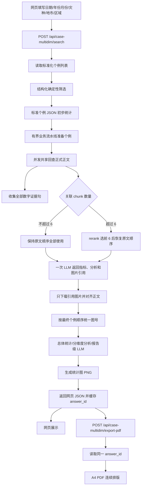

# 个例多维检索智能体实现说明

## 1. 项目定位

`case_multidim_search` 是一个面向山西气象灾害业务复盘的结构化多维检索与报告生成模块。它把用户提交的时间、灾种、地市和业务区域条件，转换为可解释的个例筛选结果，并在此基础上完成：

- 标准化天气过程的确定性筛选；
- 每个命中个例的正式正文证据回查；
- 过程强度指标提取与来源追溯；
- 逐例天气过程分析；
- 总体概况、分维度统计、代表个例分析、综合结论与业务建议；
- 统计图表、网页审阅、CSV 导出和 PDF 报告导出。

当前模块固定采用公司统一知识库 HTTP API，不再读取本地 `standard_cases.json`、本地 Chroma、`image_metadata.json` 或本地 `document_images` 作为主数据源。

## 2. 总体架构

### 2.1 主要组件

| 文件 | 主要职责 |
|---|---|
| `router.py` | FastAPI 路由、请求校验、进度接口、网页入口、CSV/PDF/图片资源下载 |
| `schemas.py` | 检索请求、强度指标、个例结果、图表、网页响应和 PDF 请求的数据协议 |
| `company_kb_client.py` | 公司知识库 HTTP 请求、鉴权、超时、相对 URL 拼接、远程图片下载 |
| `company_stores.py` | 把公司接口适配为三个存储接口，并发共享读取正文 chunk、按需解析图片元数据 |
| `structured_retriever.py` | 时间、灾种、区域的确定性多条件过滤 |
| `case_chunk_analyzer.py` | 按个例关联 chunk 回查原文、chunk 精排、一次生成指标与逐例分析并缓存 |
| `intensity.py` | 基于正式关联正文的规则型强度抽取 |
| `llm_intensity_extractor.py` | 收集全部数字证据句，并校验一次逐例调用返回的指标来源和单位 |
| `non_thinking_llm.py` | 关闭 Qwen3 思考模式，并把本模块生成式 LLM 总并发限制为两路 |
| `aggregator.py` | 月份、灾种、地市、灾种共现、强度分布等统计聚合 |
| `report_analyzer.py` | 总体概况、分维度分析、强度汇总表、结论、建议和阈值核对 |
| `report_llm_enhancer.py` | 报告级综合结论、建议和图表启示增强，失败时保留规则结果 |
| `chart_tool.py` | 根据统计数据选择白名单图表规格并渲染 PNG |
| `agent.py` | 编排完整检索、分析、图片统一编号、响应缓存和导出流程 |
| `chat_page.html` | 浏览器端筛选表单、进度轮询、报告渲染和导出操作 |
| `pdf_report.py` | 将已缓存分析结果编排为 A4 PDF |
| `report_document.py` | PDF 的分页、字体、表格、正文、图片、图注和页码排版 |
| `exporter.py` | 命中个例的 CSV 导出 |
| `progress.py` | 线程安全的检索/PDF 导出阶段状态存储 |

### 2.2 端到端流程



## 3. 数据来源与接口

运行配置主要包括：

```text
CASE_MULTIDIM_KB_BASE_URL   公司知识库地址
CASE_MULTIDIM_KB_API_KEY    可选 API Key
CASE_MULTIDIM_KB_TIMEOUT    HTTP 超时，默认 30 秒
CASE_MULTIDIM_KB_CACHE_TTL  标准个例和图片元数据缓存时间，默认 300 秒
CASE_MULTIDIM_RUNTIME_DIR   报告、图表、缓存和远程图片目录
```

模块使用的公司接口如下：

| 用途 | 接口 |
|---|---|
| 知识库状态 | `GET /api/v1/kb/status` |
| 标准化个例列表 | `GET /api/v1/artifacts/standard-cases` |
| 正文 chunk | `GET /api/v1/artifacts/chunk/{chunk_id}` |
| 图片元数据 | `GET /api/v1/artifacts/image-metadata` |
| 图片资源 | 图片元数据中的 URL，经知识库基地址补全后按需下载 |

模块不直接调用 RAG 查询接口生成报告。原因是本业务需要完整命中个例集合、每个个例的关联正文、图片图注以及固定的报告结构，因此采用“标准个例筛选 + 个例正文证据回查”的组合流程。

## 4. 结构化检索规则

前端提供以下条件：

- 精确开始日期和结束日期；
- 年份、月份快捷筛选；
- 灾种多选；
- 地市多选；
- 业务区域多选，如晋北、晋中、晋南、山西北部、全省等。

过滤逻辑是“维度之间 AND、同一维度内部 OR”：

- 时间维度：日期范围采用过程时间重叠判断；年份或月份只要与个例有交集即可；
- 灾种维度：勾选多个灾种时，命中任一灾种即可；“雷暴大风”兼容原子标签“雷暴”和“大风”；
- 影响区域维度：地市和区域合并为同一维度，勾选任一地市或区域即可；
- 未填写的维度不参与过滤。

命中结果按匹配得分、开始日期和 `case_id` 稳定排序。标准化个例字段缺失时，适配层会从标题、时间范围、摘要、影响区域和来源文件名回填年份、月份、地市标签等派生字段。

## 5. 两阶段分析链路

### 5.1 第一阶段：标准个例元数据

标准个例列表用于：

- 执行确定性检索；
- 统计命中数量、月份、灾种、地市和灾种共现；
- 形成 JSON 初步概况，便于审计两阶段结果。

这一阶段不加载正文 chunk，也不把摘要中的单个数值直接当作最终强度极值。

### 5.2 第二阶段：正式关联正文

对每个命中个例，程序只按该个例的 `source_chunk_ids` 回查正文。强度汇总、主要影响区域和逐例分析均以这些正式关联正文为依据：

- 全部关联 chunk 会先装入当前个例上下文；
- 关联 chunk 不超过 6 个时，全部保留，并按 `chunk_no` 恢复原文顺序；
- 超过 6 个时，在当前个例内部调用 rerank 选择最相关的 6 个，再恢复原文顺序；
- rerank 不可用或失败时，按原文顺序取前 6 个；
- 字符上限只在送入逐例大模型的上下文组装阶段控制，不会因为“上限 6”而误判只有 4 个 chunk 的个例；
- 强度指标使用全部正式正文生成的数字证据句，避免只使用精排片段造成漏值。

逐例准备任务与模型生成形成流水线，生成式 LLM 最多并发两路；异步结果按原始索引归位，最终顺序不受完成先后影响。

## 6. 逐例分析与大模型协议

逐例大模型只接收当前个例的全部数字证据句、精选正文、个例元信息和候选图片图注，不接收其他个例正文。一次调用同时返回强度指标和三个篇幅接近的中文段落：

1. 过程演变、主导灾种、重点落区和可核验强度；
2. 天气系统、动力热力条件、地形调制与强度峰值时段的对应关系；
3. 预报偏差、预警提前量或服务针对性，以及完整业务动作。

模型协议为 JSON：

```json
{"metrics":[{"metric_name":"过程最大降水量","value":303,"unit":"mm","source_chunk_id":"...","source_text":"...","confidence":0.95}],"analysis":"完整的三段报告正文","cited_image_ids":["正文实际引用的图片ID"]}
```

返回处理包括：

- 清除 `<think>` 思考链和代码块包装；
- 解析被解释文字包裹的 JSON；
- 核验指标名、单位、当前个例 chunk 和原文证据句；
- 只接受候选图片 ID；
- 要求图片 ID 必须同时在正文中有图号或完整图题引用；
- 删除候选列表之外的图号引用句；
- 对未结束的输出截到最后一个完整句号；
- 对完整但未分段的长文本整理为三个自然段；
- 空结果、调用异常、正文过短或不完整时使用规则生成的个例分析；
- 成功结果按提示词和正文内容缓存，缓存版本变更后自动失效。

因此，终端日志中的模型原始响应仅用于排障，网页和 PDF 只显示清洗后的正式报告正文。

## 7. 强度指标提取与重点汇总

### 7.1 指标来源与校验

证据整理器先从当前个例全部正式关联正文中收集含数字完整句和必要承接句，不预判极值；模型综合全部证据后返回以下白名单指标：

- 过程最大降水量、最大小时雨强；
- 最大风速、极大风速、阵风风力；
- 最高气温、最低气温、过程降温幅度；
- 过程最大降雪量、最大积雪深度；
- 最低能见度、最大冰雹直径、雷达回波强度等。

每个 `IntensityMetric` 携带指标名、数值、单位、地点、关系描述、来源 chunk、原文证据句和置信度。处理规则包括：

- 同一指标的范围取上限；最低能见度取下限；
- 同时出现国家站和区域站极值时，比较同一过程的有效值并保留过程极值；
- 过程累计降水与小时雨强分开识别，避免 1 小时数值污染过程累计值；
- 过滤月度、全省气候概况等不属于当前个例过程的背景值；
- 图片附近文字不作为强度来源；
- 单位统一，如毫米、米/秒、摄氏度、公里等；
- 风力等级优先根据最大风速按风力等级表确定，而不是直接照抄跨句或跨个例的等级；
- 大模型补充指标时，要求给出合法 chunk_id 和原文句子，并检查原文句子的前缀确实存在于该 chunk 中。

规则结果与大模型结果按指标、数值、单位和来源 chunk 去重合并，并写入 `intensity_metric_cache`。

### 7.2 主导灾种与分组表

每个个例只显示一个主导灾种字段，但该字段必须来自本次检索条件实际命中的灾种：

- 优先选择标题中最先出现、且确实命中的检索灾种；
- 标题没有明确命中时，按用户勾选顺序兜底；
- 一个个例命中多个灾种时仍只选一个主导灾种，用于表格分组；
- 个例正文和“同时涉及灾种”仍可保留完整并发灾种信息。

重点个例强度汇总按主导灾种细分表格。每张表固定包含：个例、主导灾种、主要影响区域，另动态选择最多 3 个且至少有有效数据的相关指标。当前预置分组包括：

- 强对流、雷暴大风、大风、雷暴类；
- 暴雨、大暴雨、强降水、短时强降水类；
- 冰雹、寒潮、雨雪、降雪、暴雪、低温类；
- 高温类、沙尘类、雾类、霜冻类。

主要影响区域同样只从该个例的完整正式关联正文统计：若材料明确为全省，则显示“全省”；否则统计市级或区域名称出现次数，最多展示 5 个高频区域。一个过程可同时影响多个地市，因此空间次数不能解释为互斥占比。

## 8. 总体概况、统计分析与图表

`ReportAnalyzer` 生成四个分维度章节：

1. 时间分布特征：月份覆盖、集中时段和季节标签；
2. 灾种结构特征：检索灾种与伴随灾种的共现关系；
3. 空间影响特征：地市/区域出现次数、高频影响区及统计口径；
4. 关键强度指标特征：按指标语义选择过程最大、最低或代表性极值。

总体概况会区分“检索条件用于定位过程”和“过程是否达到该灾种业务阈值”，并可对暴雨、大暴雨、短时强降水等进行确定性阈值核对，避免把检索标签直接写成强度达标结论。

`ChartTool` 只接受 `ChartSpec` 白名单类型，按样本是否有数据动态选择图表。常见图表包括月份分布、灾种频次、地市高频影响区横向条形图、灾种共现热力图，以及按当前灾种和有效指标生成的特色强度横向条形图。空间图使用“命中个例数排名”，不使用会暗示互斥占比的饼图口径。

图表由规则解释生成基础启示；报告级大模型可在严格 JSON 协议下改写图表启示，且会阻止把空间次数解释为占比。图表 PNG 写入运行时 `reports` 或 `charts` 目录，并通过 `/api/case-multidim/assets/{filename}` 提供访问。

## 9. 网页端报告内容与交互

网页入口为 `GET /api/case-multidim/chat`，页面由 `chat_page.html` 提供，主要区域如下：

### 9.1 检索工作台

- 日期范围、年份、月份条件；
- 灾种复选框；
- 地市和业务区域复选框；
- 开始检索、重置、导出 PDF、导出 CSV 按钮。

提交后前端每 500 ms 轮询 `/api/case-multidim/search/progress/{progress_id}`，显示阶段、百分比和已完成个例数。后端阶段包括标准个例筛选、JSON 初步统计、逐例分析、报告级分析、图表渲染和结果保存。

### 9.2 页面展示顺序

命中结果返回后，网页按固定顺序渲染：

1. 命中个例数、当前展示个例数、可预览图片数、生成图表数；
2. 总体概况；
3. 重点个例强度汇总；
4. 分维度分析及对应统计图；
5. 按主导灾种分组的逐个例分析；
6. 综合结论与业务建议。

逐例分析卡片包含个例标题、归属灾种、同时涉及灾种、分析正文、强度指标和正式证据图片。图片在当前实现中放在完整个例分析正文之后；图片的候选图注先送入模型，只有模型实际引用且通过图号/图题校验的图才进入展示；没有可确认引用时，该个例不展示未被正文引用的图片。

### 9.3 图片编号与正文引用统一

后端在所有个例完成分组后统一执行：

1. 按最终逐例顺序遍历图片；
2. 从原图注中去掉旧图号，生成全局连续的 `display_number` 和 `display_caption`；
3. 以占位符进行两阶段替换，把正文中的旧图号、中文数字图号和子图引用改写成新图号；
4. 网页和 PDF 共同使用改写后的 `analysis`、`display_number`、`display_caption`。

因此，网页和 PDF 的个例顺序、图片顺序、图号和正文引用来自同一份缓存响应，不会因为 PDF 单独重新编号而产生差异。

## 10. PDF 报告生成与排版

### 10.1 导出流程

网页完成检索后得到 `answer_id`。点击导出 PDF 时，前端调用：

```text
POST /api/case-multidim/export-pdf
GET  /api/case-multidim/export-pdf/progress/{progress_id}
```

后端读取 `runtime/reports/answers/case_answer_*.json` 中已缓存的完整 `CaseAnalysisResponse`，不重新调用逐例大模型。随后 `PdfReportBuilder` 重新渲染统计图 PNG，并交给 `ReferenceReportDocument` 连续编排。

### 10.2 PDF 章节顺序

PDF 与网页保持相同的业务内容顺序，只在最前面增加标题、生成日期和分行检索条件副标题：

1. 标题、生成日期、检索条件副标题；
2. 综合概况和重点个例强度汇总；
3. 主要分析：时间、灾种、空间、强度四个小节及对应统计图；
4. 代表个例分析：按网页相同顺序编号，图片紧跟对应个例正文；
5. 综合结论与建议。

检索条件副标题按“月份、灾种、地市/区域”分行写入，避免所有条件挤成一行。

### 10.3 页面和字体参数

`ReferenceReportDocument` 使用白底 A4 技术报告版式：

- A4 尺寸，固定左右、上下页边距；
- 中文正文优先使用宋体，标题优先使用黑体；
- 正文 12 磅、标题 15 磅左右、图注 11 磅；
- 正文首行缩进，段落按自然换行处理；
- 表格单元格按列宽自动换行；
- 图片按原始宽高比缩放，空间不足时缩图或分页；
- 图片插入后立即写图注，图注过长可自动换行；
- 每页底部绘制页码；
- 使用高质量重采样，统计图以 PNG 进入 PDF。

统计图在对应分维度正文后插入；代表个例则先写完整分析正文，再写该个例实际关联的原始图片及统一图注。PDF 端不会把未通过图片引用校验的图片堆到个例末尾。

## 11. 缓存、导出和健康检查

### 11.1 缓存

- 标准个例和图片元数据由公司 store 按 TTL 缓存；
- 远程图片只在需要展示或导出时下载到 `runtime/remote_images/images`；
- 逐例分析缓存位于 `reports/case_analysis_cache`；
- 强度指标缓存位于 `reports/intensity_metric_cache`；
- 完整网页分析响应按 `answer_id` 保存，供 PDF 重用。

### 11.2 其他接口

- `GET /api/case-multidim/health`：知识库、正文 chunk、图片元数据和中文字体状态；
- `POST /api/case-multidim/search/export/csv`：导出结构化命中个例；
- `GET /api/case-multidim/assets/images/{image_id}`：读取远程图片本地缓存；
- `GET /api/case-multidim/assets/{filename}`：读取生成统计图。

CSV 直接导出标准化个例字段，不经过大模型重写，主要用于人工核对个例编号、标题、日期、灾种、地市和来源文件。

### 11.3 降级与错误处理

- 公司知识库接口超时、地址错误或 HTTP 错误会沿路由返回结构化失败信息，并写入进度状态；
- 缺失单个 chunk 时允许跳过，其他接口错误继续暴露；
- rerank 失败回退到原文顺序；
- 逐例大模型不可用或返回不完整时回退规则分析；
- 报告级大模型返回非法 JSON 或不满足完整性检查时保留规则报告；
- 图片无法下载或无法解码时不阻塞整份报告，并在个例处给出图像不可用提示；
- 无命中时网页只展示简洁空状态，不生成空章节。

## 12. 当前审计信息与可验证边界

响应中的 `audit` 保存结构化候选数、完整分析数、展示数、图片数、图表数、缓存路径、逐例状态和选用 chunk 数等信息，便于定位“检索命中”和“页面展示”的差异。

需要在汇报中明确的边界：

1. 检索条件是筛选入口，不代表所有命中过程都达到所勾选灾种的业务强度标准；
2. 强度指标只有在正式关联正文出现且通过规则/来源校验后才进入汇总；
3. 地市空间统计是个例涉及次数，同一个例可计入多个地市，不能当作互斥覆盖率；
4. 报告模型不会凭空补充正文没有的风速、雨强、探空、雷达或预警提前量；
5. 公司知识库服务可用性仍是整个流程的外部前置条件，服务超时会导致检索失败，不属于本地 chunk 选择逻辑；
6. 逐例正文默认最多使用 6 个精选 chunk，但少于 6 个时全部使用；字符上限是上下文长度控制，不是“必须凑够 6 个”。

## 13. 已有验证方式

模块自带本地测试脚本，覆盖路由暴露、公司 store 适配、灾种归属、图片引用、强度范围与跨个例污染、风力等级换算、PDF 副标题、空间图口径、少量 chunk 全量使用、逐例段落完整性、报告结论生成痕迹过滤等场景。

建议汇报前执行：

```powershell
python -m compileall backend\app\services\agent\case_multidim_search
python -m unittest backend.app.services.agent.case_multidim_search.tests.test_local_scripts
```

若知识库地址未启动或网络不可达，测试中的纯规则和模拟 store 场景仍可验证本模块逻辑，但真实网页检索、远程图片下载和 PDF 完整导出需要公司知识库服务可用。

## 14. 汇报时可采用的概括

本系统不是简单的全文搜索或一次性大模型问答，而是“结构化条件定位标准个例—按个例关联正文回查证据—规则与大模型结合提取强度—逐例复盘—统计汇总—统一生成网页和 PDF 报告”的业务流水线。其核心控制点有三个：第一，检索和正文证据分层，避免跨个例污染；第二，指标和图片都保留来源校验，避免把模型推测写成事实；第三，网页和 PDF 复用同一个最终响应，统一个例顺序、图片编号和正文引用，保证审阅版与正式报告一致。
